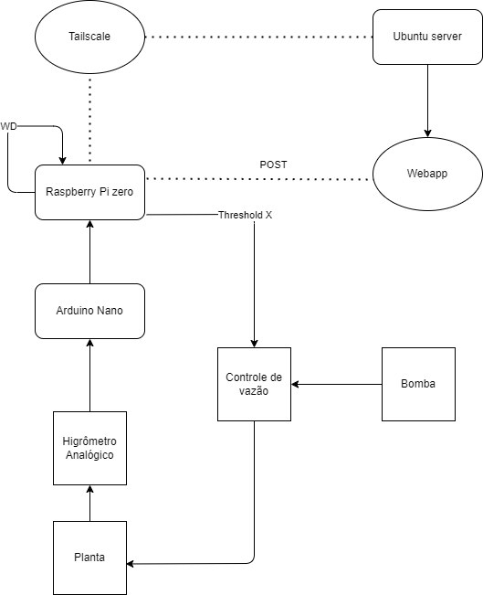

# **Plant Monitor**

A simple system for soil moisture monitoring, designed to run on a server and send sensor data via Raspberry Pi Zero W.

## **Description**
The **Plant Monitor** is an IoT project to monitor soil moisture for plants. It includes:
- A Node.js server with WebSocket for real-time communication.
- SQLite database to store moisture data.
- Simple web interface for data visualization.
- A data-sending script configured to run on a Raspberry Pi Zero W.

## **Features**
- Stores and displays the most recent moisture data sent by the sensor.
- Real-time chart updates on the interface using WebSocket.
- Structured logs for debugging and monitoring.

---

## **Prerequisites**
- **Hardware**:
  - Raspberry Pi Zero W (or similar).
  - Arduino (Nano or Uno or similar).
  - Soil moisture sensor.
- **Software**:
  - Node.js (>= v18.0).
  - SQLite3.
  - Bash (for scripts).
  - `npm` to manage dependencies.

---

## **Installation**
### 1. Clone the Repository
```bash
git clone https://github.com/username/plant-monitor.git
cd plant-monitor
```

### 2. Run the Makefile
Use the Makefile to install dependencies and configure the project:
```bash
make config
```

### 3. Configure the Data Sending Script
Ensure the `humidity_sender.sh` script is properly configured to send data to the server:
```bash
#!/bin/bash
SERVER_URL="http://<your-server>:3000/api/humidity"
```

Replace `<your-server>` with the IP address or hostname of your server.

---

## **Usage**
### Start the Server Manually
To start the server manually, run:
```bash
make start
```

### Test Data Sending with `curl`
```bash
make test-curl
```

### Test Send Script
```bash
make test-sender
```

---

## **Project Structure**

```plaintext
plant-monitor/
├── server.js          # Node.js server
├── logger.js          # Logging system
├── Makefile           # Project automation
├── humidity_sender.sh # Raspberry Pi data-sending script
├── frontend/
│   ├── index.html     # Web interface
│   ├── styles.css     # Interface styles
│   └── script.js      # Frontend logic
```

---

## **How It Works**
1. The soil moisture sensor sends data to the analog input of the Arduino.
2. The Arduino sends the data through the serial ports to the Raspberry Pi.
3. The Raspberry Pi sends soil moisture data every 2 minutes via a `POST` request.
4. The server stores the data in a SQLite database.
5. The server uses WebSocket to notify connected clients of new data.
6. The web interface updates the real-time chart dynamically.

---

## **Application Diagram**



## **License**
This project is licensed under the [GPL-3.0 license](LICENSE).
