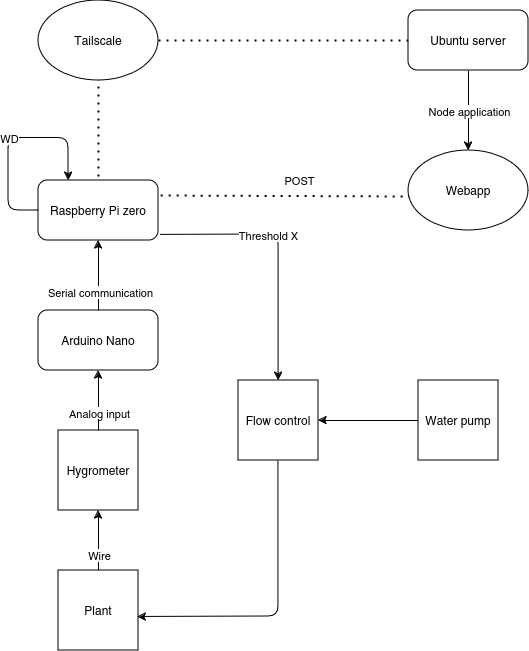

# **Plant Monitor**

A flexible system for soil moisture monitoring, designed to work in local networks or adapt to more advanced use cases with different hardware configurations.

---

## **Description**
The **Plant Monitor** is an IoT project for monitoring plant soil moisture, with two main implementation options:

1. **Setup with Raspberry Pi Zero W (or similar) + Arduino or ADC**:
   - Ideal for those looking to expand the project in the future, using the RPi Zero W as a gateway.
   - In future iterations, it could be feasible to connect a LoRa antenna to the RPi Zero W for long-range communication, filtering the received data before sending it to the server.

2. **Setup with NodeMCU ESP8266**:
   - If you have direct access to the network where the server is hosted, you can use just the ESP along with the moisture sensor for direct communication.

Additionally, the system supports running the server directly on the Raspberry Pi Zero W, making it a standalone solution if desired.

For the current use case, the system is designed to operate within a local network. However, when used outside of the home network, the Raspberry Pi Zero W can send data via Tailscale for secure remote communication.

---

## **Features**
- **Flexible Hardware Configurations**:
  - Raspberry Pi Zero W as a gateway or standalone server.
  - NodeMCU ESP8266 for direct communication.
- **Future Expandability**:
  - LoRa antenna support for long-range data collection.
- **Local and Remote Operation**:
  - Tailscale support for secure remote data transmission.
- Real-time data visualization via a web interface.
- Structured logs for debugging and monitoring.

---

## **Prerequisites**
### **Hardware**:
- **Option 1**:
  - Raspberry Pi Zero W (or similar).
  - Arduino (Nano, Uno, or similar) or ADC.
  - Soil moisture sensor.
- **Option 2**:
  - NodeMCU ESP8266.
  - Soil moisture sensor.

### **Software**:
- Node.js (>= v18.0).
- SQLite3.
- Bash (for scripts).
- `npm` to manage dependencies.

---

## **Installation**
### 1. Clone the Repository
```bash
git clone https://github.com/username/plant-monitor.git
cd plant-monitor
```

### 2. Run the Makefile
Use the Makefile to install dependencies and configure the project:
```bash
make config
```

### 3. Configure the Data Sending Script
Ensure the `humidity_sender.sh` script is properly configured to send data to the server:
```bash
SERVER_URL="http://<your-server>:3000/api/humidity"
```

Replace `<your-server>` with the IP address or hostname of your server.

---

## **Usage**
### Start the Server Manually
To start the server manually, run:
```bash
make start
```

### Test Data Sending with `curl`
```bash
make test-curl
```

### Test Send Script
```bash
make test-sender
```

---

## **Project Structure**
```plaintext
plant-monitor/
├── server.js          # Node.js server
├── logger.js          # Logging system
├── Makefile           # Project automation
├── humidity_sender.sh # Data-sending script
├── frontend/
│   ├── index.html     # Web interface
│   ├── styles.css     # Interface styles
│   └── script.js      # Frontend logic
```


## **Application Diagram**



## **License**
This project is licensed under the [GPL-3.0 license](LICENSE).
